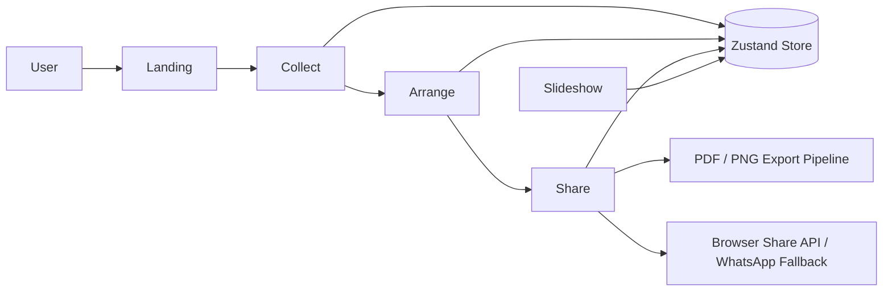

# MemoryWall Architecture And Design V1

## Architecture Style

MemoryWall V1 uses a frontend-centric architecture with route-driven pages and a single client-side state store.

## Major Building Blocks

- `TanStack Router`
  Handles route definitions and application navigation.
- `Zustand Store`
  Maintains uploaded media and background audio state.
- `Route Components`
  Implement page-level workflows.
- `Shared Components`
  Provide navigation, slideshow, safety panel, and UI primitives.
- `Client Export Pipeline`
  Uses `html2canvas` and `jsPDF` to generate output locally.

## High-Level Diagram

## Design Decisions In V1

### 1. In-Memory Store

The app stores media in Zustand using object URLs. This keeps V1 simple and removes backend complexity, but state is not durable across refreshes.

### 2. Client-Side Export

The export pipeline converts preview content into canvases and then into PDF/PNG. This avoids server dependencies and keeps the workflow immediate.

### 3. Route-Based Workflow

The user journey is linear:

- Collect
- Arrange
- Share

This reduces ambiguity and keeps the app easy to understand.

### 4. Theme Tokens

Colors and effects are driven through CSS custom properties. This is why multiple themes can be supported without rewriting components.

## Tradeoffs

### Advantages

- simple deployment
- no backend requirement
- fast iteration
- easy to test locally

### Disadvantages

- no persistence
- no real share links
- export performance depends on browser/device capability
- state management is limited to the current session
