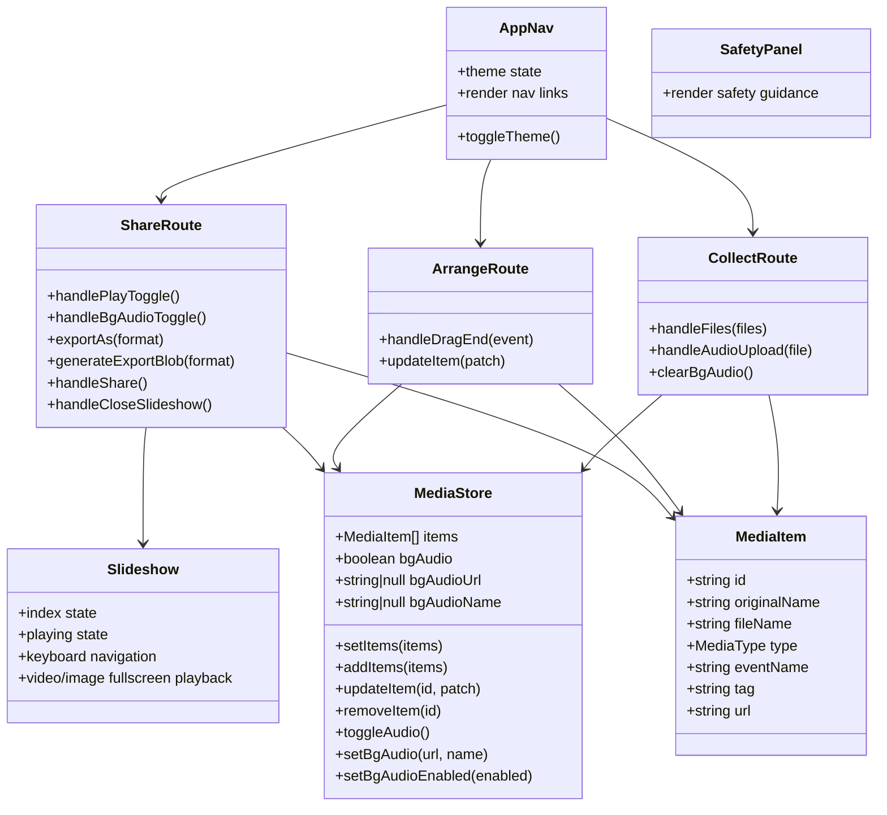

# MemoryWall Class Diagram V1

The app is React-function-component based, so this diagram models the logical classes/modules and their main responsibilities rather than traditional OO inheritance-heavy classes.

## Notes

- `MediaStore` is the main state hub in V1.
- `CollectRoute`, `ArrangeRoute`, and `ShareRoute` act as orchestration modules.
- `Slideshow` is a presentation-focused runtime component invoked from `ShareRoute`.
