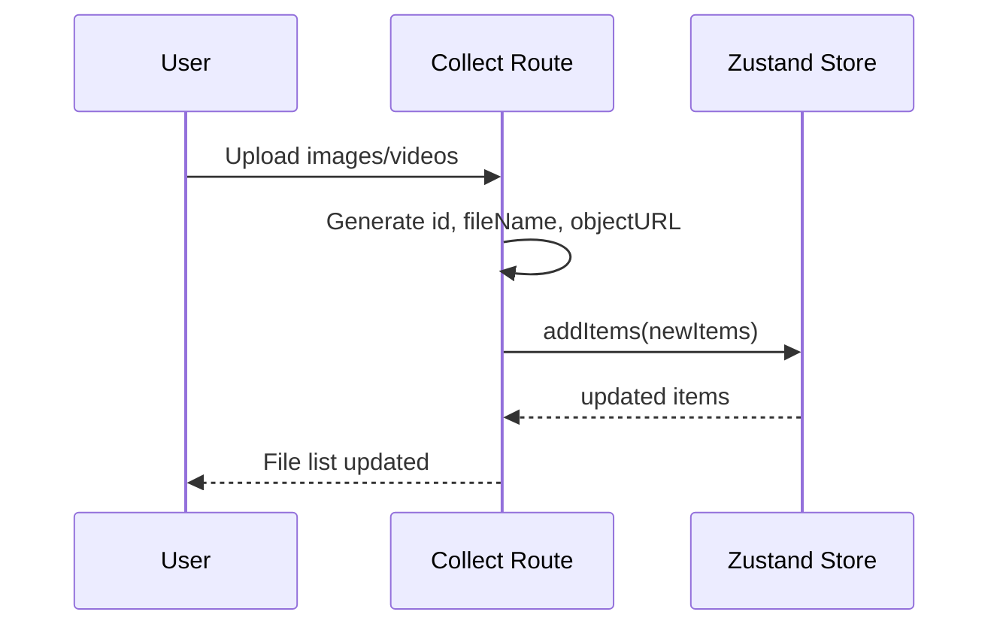
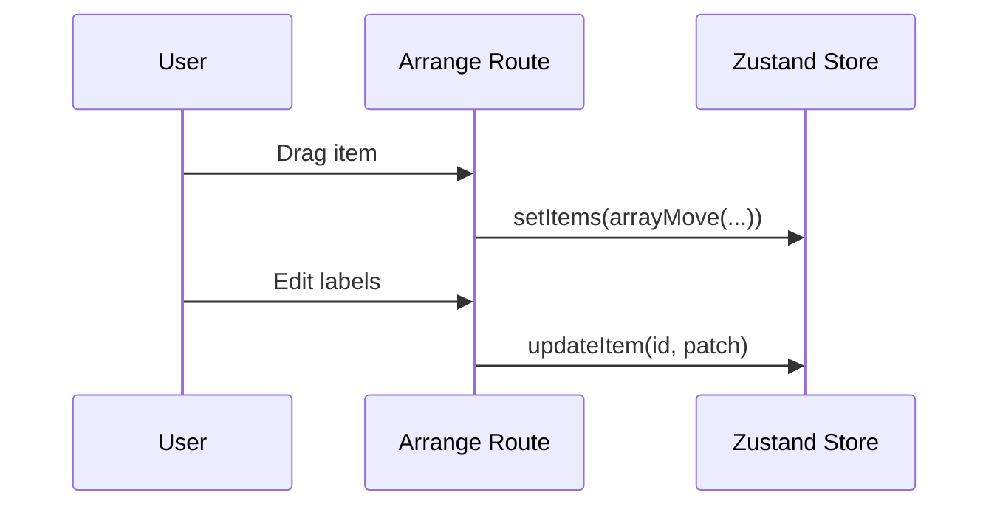
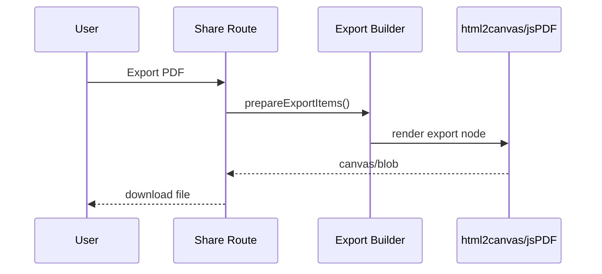
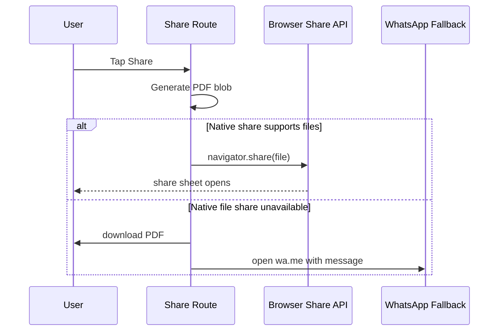

# MemoryWall Low Level Design V1

## 1. Main Modules

### 1.1 Routing Layer

Files:

- [router.tsx](/D:/memorywall/src/router.tsx)
- [__root.tsx](/D:/memorywall/src/routes/__root.tsx)

Responsibilities:

- initialize router
- define app shell
- render toaster and not-found/error states

### 1.2 Store Layer

File:

- [media-store.ts](/D:/memorywall/src/lib/media-store.ts)

Responsibilities:

- maintain uploaded media collection
- maintain background audio state
- expose mutation methods

State:

- `items`
- `bgAudio`
- `bgAudioUrl`
- `bgAudioName`

Mutators:

- `setItems`
- `addItems`
- `updateItem`
- `removeItem`
- `toggleAudio`
- `setBgAudio`
- `setBgAudioEnabled`

### 1.3 Collect Route

File:

- [collect.tsx](/D:/memorywall/src/routes/collect.tsx)

Responsibilities:

- upload media
- upload/remove main audio
- generate media metadata
- display compact file preview list

### 1.4 Arrange Route

File:

- [folder.tsx](/D:/memorywall/src/routes/folder.tsx)

Responsibilities:

- reorder items using dnd-kit
- edit metadata
- continue to preview flow

### 1.5 Share Route

File:

- [preview.tsx](/D:/memorywall/src/routes/preview.tsx)

Responsibilities:

- render A4-style preview
- manage preview playback
- manage export pipeline
- manage share behavior
- coordinate slideshow launch/close

### 1.6 Slideshow Component

File:

- [Slideshow.tsx](/D:/memorywall/src/components/Slideshow.tsx)

Responsibilities:

- fullscreen media playback
- keyboard navigation
- image/video presentation
- slideshow audio behavior for active video playback

## 2. Key Runtime Flows

### 2.1 Upload Flow

### 2.2 Arrange Flow

### 2.3 Export Flow

### 2.4 Share Flow

## 3. Error Handling

- route-level default error component in router
- toast feedback for export/share/upload failure states
- not-found page at root route level

## 4. Known Technical Gaps

- no persistent store adapter
- no upload service
- no server API contract
- no typed backend DTOs because V1 is local-only
